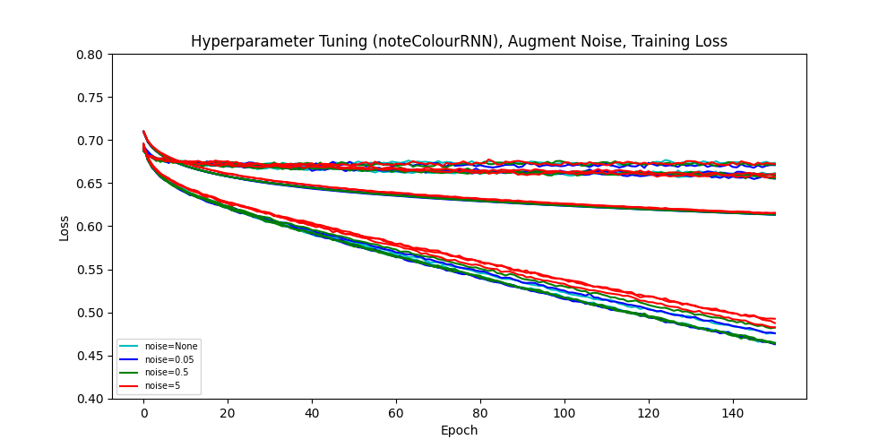

# TaikoMapper
An *osu!Taiko* Map Generator. Created as a final project for CSC413H5 Winter 2022 at the University of Toronto Mississauga.

*Dependencies: Python 3.8, librosa, ffmpeg, pydub, PyTorch, tqdm.*

## Introduction

### osu!Taiko
[*osu!*](https://osu.ppy.sh/) is a free-to-play rhythm game in which players attempt to click on circles to the beat of the music. In *osu!Taiko*, a game mode in *osu!* inspired by *Taiko no Tatsujin*, players are presented with a sequence of incoming red and blue circles (called "don"s and "kat"s respectively) approaching a drum. When a don or kat arrives at the center of the drum, the player must use the keyboard to tap the drum in the center (default keys X or C) or on the edge (Z or V) according to the colour of the note. Both don's and kat's also have a respective "finisher" variant (indicated by a larger circle of the respective colour), requiring the player to tap both center or both edge keys. (There are also *slider* and *spinner* notes, which are sparsely used and ignored in our model.)

A sample gameplay video (played by Sloan Chochinov ([@Hazelstorm](https://github.com/Hazelstorm))) can be found [here](https://www.youtube.com/watch?v=7wP_YnOfpj8).

Taiko levels are stored in "beatmaps" (also known as "difficulties" or simply "maps"), and are community-created. Maps for the same song are grouped into "mapsets", which may be uploaded to the *osu!* website. Each Taiko mapset contains an audio file (typically MP3) and one ".osu" file for each difficulty. The .osu file format is in human-readable, and contains the following information:
- Filename of the audio file.
- Song/mapset/difficulty metadata, such as song title, song author, beatmap author, difficulty name, and gamemode. The ```Mode``` field specifies the gamemode; ```Mode: 1``` is used for *osu!Taiko* maps.
- Gameplay difficulty parameters, such as ```OverallDifficulty``` which determines the precision at which the player needs to hit the notes (increasing ```OverallDifficulty``` decreases the time window for the player to hit notes).
- Aesthetic information, such as the filename of the map's background image.
- Timing information, including the BPM (tempo) and offset (time of first beat in milliseconds, relative to start of audio file) of the song. There could be multiple BPMs and offsets for a song with varying tempo. 
- The notes in the map. For Taiko, each note has an offset (relative to the start of the audio file) and a "type" (used to determine whether the note is a don/kat and whether the note is a finisher). 

Typically, a Taiko mapset has one or more of the following difficulty names, in order of increasing gameplay difficulty: "Kantan" (Easy), "Futsuu" (Normal), "Muzukashii" (Hard), "Oni" (Demon). However, mapset creators can give custom names to difficulties, especially for difficulties that are harder than Oni. We ignore such difficulties in our model, and only parse for Kantan, Futsuu, Muzukashii, and Oni difficulties.

For more detailed information on the .osu file format, refer to the [*osu!Wiki*](https://osu.ppy.sh/wiki/en/Client/File_formats/Osu_%28file_format%29).

### TaikoMapper

TaikoMapper consists of three seq2seq models (found in ```rnn.py```) that together produce *osu!Taiko* maps. The three models are called ```notePresenceRNN```, ```noteColourRNN```, and ```noteFinisherRNN``` respectively. TaikoMapper takes in a preprocessed (see the paragraphs below) audio file, and outputs a time series of Taiko notes. 

To preprocess an audio file, we require the ```BPM``` and ```offset``` of the song (note that TaikoMapper only supports songs that don't have varying tempos). With inspiration from [*Osu! Beatmap Generator*](https://github.com/Syps/osu_beatmap_generator), the audio is first converted into a [mel spectrogram](https://en.wikipedia.org/wiki/Mel_scale) using [```librosa```](https://librosa.org/doc/latest/generated/librosa.feature.melspectrogram.html). The mel scale divides the total range of frequencies (```fmin``` and ```fmax``` in ```hyper_param.py```) into frequency bands of equal logarithmic length. The spectrogram produced by this procedure has shape ```L x n_mels```, where ```L``` is the length of the audio file (in milliseconds) and ```n_mels``` (specified in ```hyper_param.py```) is the number of frequency bands (or "mel"s) in the frequency range. 

Then, we extract a time window from the spectrogram around each "snap", and place the time windows into a sequence.  A "snap" is a time point on the boundary of each 1/4 regular subdivision of a measure/bar, the length of one bar being 60000/BPM milliseconds (for example, in a 100BPM song, each bar is 600ms in length, so each snap is 150ms apart. If a bar begins at time 1000ms, the snaps occur at 1000ms, 1150ms, 1300ms, 1450ms, ...). The time window size is specified by ```window_size``` in ```hyper_params.py```; we extract ```window_size``` ms to the left and right of each snap from the spectrogram. The resulting sequence of time windows has size ```N x (2 * window_size + 1) x n_mels```, with ```N``` being the total number of snaps in the audio file. We flatten the spectrogram windows to instead have size ```N x ((2 * window_size + 1) * n_mels)```.

To the spectrogram windows, we also append a length-4 one-hot "snap number" vector. The '1' in the snap number vector represents the snap within the bar. For example, if there is a '1' in the 0th entry, then the snap occurs on a whole beat (in the previous example these would occur at 1000ms, 1600ms, ...); if there is a '1' in the 3rd entry, the snap occurs on a beat + 3 snaps (1450ms, 2050ms, ...). 

Taikomapper receives this ```N x ((2 * window_size + 1) * n_mels + 4)``` sequence of spectrogram windows around each snap with the appended one-hot snap number vector, and produces three sequences of length ```N``` (one from each of  ```notePresenceRNN```, ```noteColourRNN``` and ```noteFinisherRNN```). The first sequnece determines the presence or absence of a note occurring on the respective snap; the second sequence determines the colour of the note occurring on that snap (don or kat), if any; the third sequence determines whether the note occuring on that snap is a finisher


## Model

TaikoMapper's is constructed using three seq2seq models, all having a bidirectional GRU, that feed into each other. The three seq2seq models are:
- ```notePresenceRNN```, used to determine where the taiko notes are placed (ignoring note type). ```notePresenceRNN``` accepts the ```N x ((2 * window_size + 1) * n_mels + 4)``` sequence of spectrogram windows appended with the snap vector, and outputs a sequence of ```N``` floats, with positive value indicating that a note should be placed on the respective snap. ```notePresenceRNN``` processes the spectrogram windows through a linear embedding layer, a bidirectional GRU, and then a linear layer with one output. The embeddings have size ```notePresenceRNN_embedding_size``` (found in ```hyper_params.py```), and the bidirectional GRU's two hidden units (one forward, one backward) have size ```notePresenceRNN_hidden_size```. On a single snap of input (one spectrogram window), the architecture looks like this:

<p align="center">
  
</p>

- ```noteColourRNN```, used to assign colour to the uncoloured sequence of notes produced by ```notePresenceRNN```. ```noteColour``` takes in the ```N x ((2 * window_size + 1) * n_mels + 4)``` spectrogram windows with snap vector, and ```notes_data```, a binary sequence of length ```N``` indicating where notes are present (0 for absent, 1 for present). ```noteColourRNN``` outputs a sequence of ```N``` floats, with positive value indicating that the note on the snap should be coloured blue (kat), and negative value indicating that a note should be coloured red. Note that ```notePresenceRNN``` is forced to predict 0 if there is no note occuring on the snap. Internally, noteColourRNN concatenates ```notes_data``` to the spectrogram windows, and then again passes it through a linear embedding layer, a bidirectional GRU (hidden size ```noteColourRNN_hidden_size```), and then a linear layer. The architecture looks like this:

<p align="center">
  
</p>

- ```noteFinisherRNN```, used to assign whether a note is a finisher to an uncoloured sequence of notes produced by ```notePresenceRNN```. Architectually, ```notefinisherRNN``` is identical to ```noteColourRNN```: the inputs are the spectrogram windows and ```notes_data```, and the output is a sequence of ```N``` floats, with positive value to indicate finisher. However, ```noteFinisherRNN``` is trained using a different loss function from ```noteColourRNN``` (see [Quantitative Measures](#quantitative-measures)), in order to place finishers instead of colouring.

The following diagram gives an overview on how the three models are connected.
<p align="center">
  
</p>

Each of the three seq2seq models can be trained separately; see ```train.py```. We believe that ```notePresenceRNN``` is the most important model out of the three models, both because the placement of Taiko notes relies on the audio (for rhythmic hints) more than the other models, as well as because the other two models receive input from ```notePresenceRNN```. 

### Number of model parameters
- ```notePresenceRNN```
  + The linear embedding layer takes in a spectrogram window of size ```(2 * window_size + 1) * n_mels + 4```, and embeds it into a vector of size ```notePresenceRNN_embedding_size```, so there are ```((2 * window_size + 1)* n_mels + 5) * notePresenceRNN_embedding_size``` trainable parameters.
  + The GRU takes in an embedding of size ```notePresenceRNN_embedding_size```, and outputs two hidden units of size ```notePresenceRNN_hidden_size```. Each bidirectional GRU has six weight matrices of size ```(input_size, hidden_size)```, another six weight matrices of size ```(hidden_size, hidden_size)```, and three bias vectors of size ```hidden_size```. To compute the update gate forward, for example, we need to apply one of the ```(input_size, hidden_size)``` matrices to the input, one of the ```(hidden_size, hidden_size)``` matrices to the previous hidden unit, and add one of the bias vectors. The reset gate and candidate hidden unit also both need one of each. Finally, we have a separate set of weight matrices for the backwards computation due to bidirectionality. Thus, in total, we have ```6 * input_size * hidden_size + 6 * hidden_size * hidden_size + 3 * hidden_size``` trainable parameters in the GRU, where ```input_size``` is ```notePresenceRNN_embedding_size``` and ```hidden_size``` is ```notePresenceRNN_hidden_size```.
  + The fully-connected linear layer at the end has input size ```2 * notePresenceRNN_hidden_size```, and output size 1, so there are ```2 * notePresenceRNN_hidden_size + 1``` trainable parameters.
- ```noteColourRNN``` and ```noteFinisherRNN```
  + The linear embedding layer takes in a spectrogram window of size ```(2 * window_size + 1) * n_mels + 4``` and a note (scalar), and embeds it into a vector of size ```noteColourRNN_embedding_size```, so there are ```((2 * window_size + 1)* n_mels + 6) * noteColourRNN_embedding_size``` trainable parameters.
  + The GRU takes in an embedding of size ```noteColourRNN_embedding_size```, and outputs two hidden units of size ```noteColourRNN_hidden_size```. So the GRU has ```6 * input_size * hidden_size + 6 * hidden_size * hidden_size + 3 * hidden_size``` trainable parameters in the GRU, where ```input_size``` is ```noteColourRNN_embedding_size``` and ```hidden_size``` is ```noteColourRNN_hidden_size```..
  + The fully-connected linear layer at the end has input size ```2 * noteColourRNN_hidden_size```, and output size 1, so there are ```2 * noteColourRNN_hidden_size + 1``` trainable parameters.

By default, we have set the following:
- ```window_size=32```, ```n_mels=40```.
- ```notePresenceRNN_embedding_size=256```, ```notePresenceRNN_hidden_size=256```.
- ```noteColourRNN_embedding_size=256```, ```noteColourRNN_hidden_size=256```.

Thus, using our computations above,
- ```notePresenceRNN``` has ```((2 * 32 + 1) * 40 + 5) * 256 = 666880``` trainable parameters in its embedding layer,```6 * 256 * 256 + 6 * 256 * 256 + 3 * 256 = 787200``` trainable parameters in its GRU, and ```2 * 256 + 1 = 513``` trainable parameters in its fully-connected layer. In total, ```notePresenceRNN``` has 
1,454,593 trainable parameters.
- ```noteColourRNN``` and ```noteFinisherRNN``` both have ```((2 * 32 + 1) * 40 + 6) * 256 = 667136``` parameters in its embedding layer, ```6 * 256 * 256 + 6 * 256 * 256 + 3 * 256 = 787200``` trainable parameters in its GRU, and ```2 * 256 + 1 = 513``` trainable parameters in its fully-connected layer. ```noteColourRNN``` and ```noteFinisherRNN``` both have 1,454,849 parameters in total.

Combining all three models together, we have 4,364,291 parameters. 

<!---
successful and unsuccessful example
--->


## Data and Preprocessing

### Source
We have downloaded a dump of "ranked" Taiko mapsets from [this osu! forum post](https://osu.ppy.sh/community/forums/topics/330552?n=1). An uploaded *osu!* mapset can become ranked after passing a quality assurance process. We chose to only use ranked mapsets from 2013-2021 to assure data quality, as older mapsets tend to have poorer quality due to the lax quality assurance criteria at the time. 

While training the model, we choose a difficulty out of Kantan, Futsuu, Muzukashii, and Oni, in hopes of encouraging the model to produce maps with an appropriate difficulty level. Our final model is trained on the Oni difficulty, but you may choose to train a Futsuu, Muzukashii, or Oni model separately if needed.

### Preprocessing
*Prerequirement: an existing osu! installation. Go to the [osu! website](https://osu.ppy.sh/home/download) to install osu!. This probably requires a Windows machine.*

First, create a ```data/``` directory in this repository's folder (in the same folder as ```preprocessing.py```). In ```data/```, create the directories ```2013/, 2014/, 2015/, 2016/, 2017/, 2018/, 2019/, 2020/, 2021```.

The Taiko mapset dump categorizes the mapsets by year. Each mapset is in .osz format, used for compressed *osu!* mapsets. To extract the mapsets, copy the .osz files into the ```osu!/Songs``` directory (replace ```osu!/``` with where *osu!* is installed, if it's installed in a different location), and launch *osu!*. In *osu!*, go to the song selection screen by clicking the large *osu!* circle and selecting *Play -> Solo*. *osu!* will begin extracting the .osz files inside the ```Songs``` directory. Once finished, the extracted mapsets should be appear as folders in the ```osu!/Songs``` directory. Copy the mapset folders into ```data/20XX``` according to the mapset's year. We recommend this extraction process be done one year at a time, so that it is easy to sort the mapsets by year.

Having all the mapsets in the ```data/``` directory, run ```preprocessing.py```. ```preprocessing.py`` performs the following:
- ```create_path_dict()```: Create the file ```data/data.pkl```. For each mapset folder in ```data/```, find the audio file, and the .osu files. For any .osu file that corresponds to a Kantan, Futsuu, Muzukashii, or Oni difficulty, the .osu file's aboslute path and the audio file's absolute path is stored in ```data.pkl```.
- ```create_data()```: Reading from ```data.pkl```, each mapset from ```data.pkl``` has its audio file converted into a mel spectrogram (not yet converted to spectrogram windows), as described in the [Introduction](#introduction) section. Each difficulty in the mapset is converted into a time series of ```N``` notes (```N``` being the number of snaps in the song), and also has its timing data (BPM, stored as ```bar_len = 60000/BPM```) and offset extracted. Both the spectrogram and notes time series are numpy arrays; these numpy arrays are dumped into the ```data/npy``` directory. The BPM and offset are stored in a json file. While processing, ```create_data()``` prints a warning and skips any map that our model cannot process (due to issues such as varying tempo or unsnapped notes). *Please note that create_data() takes a few seconds to load each audio file using librosa, and hence ```create_data()``` may take a couple hours to preprocess all mapsets.*

The conversion from spectrogram to spectrogram windows and the snap-vector concatenation is performed during training time, as we wanted the ability to change the hyperparameter ```window_size``` without preprocessing.

### Data Summary
There are a total of 2795 ranked mapsets from 2013-2021 containing a difficulty from Kantan, Futsuu, Muzukashii, and Oni. In total, there are 9113 such Taiko difficulties. However, not all mapsets are processable by our model, due to issues as mentioned previously. In total (using ```get_npy_stats.py```), there are only 5887 difficulties that are usable in our dataset.

Here are some other per-difficulty statistics:

<div align="center">

| Difficulty | Total Difficulties | Total Song Length (s) | Total snaps | Total notes | Average Song Length (s) | Average snaps count | Average notes count |
|------------|--------------------|-----------------------|-------------|-------------|-------------------------|---------------------|---------------------|
| Kantan     | 1237               | 155257.9              | 1705386     | 208665      | 125.5                   | 1378.6              | 168.7               |
| Futsuu     | 1373               | 173836.9              | 1903932     | 399403      | 126.6                   | 1386.7              | 290.9               |
| Muzukashii | 1633               | 217010.3              | 2379297     | 739280      | 132.9                   | 1457.0              | 452.7               |
| Oni        | 1644               | 234942.5              | 2616162     | 1107605     | 142.9                   | 1591.3              | 673.7               |
|            |                    |                       |             |             |                         |                     |                     |
| Total      | 5887               | 781047.6              | 8064777*    | 2454953*    |                         |                     |                     |
  
</div>
* Note that many songs are counted repeatedly, once for each difficulty.

### Data Split
We allocated 80% of the mapsets for training, 10% of the mapsets for validation, and 10% of the mapsets for testing. This is because our evaluation will be mostly qualitative; there is no objective criteria to distinguish correct and incorrect generated maps, and our loss function does not fully capture the quality of our model. Also, the validation loss is only computed every 10 epochs of training, to reduce training time. 

## Quantitative Measures
We have defined different loss measures for the three models. 
- For ```notePresenceRNN```, recall that its output of ```N``` floats indicate the note presence at that snap. The greater the float value, the more confidence the model has in placing a note at that snap. On the other hand, the ground truth is a sequence of ```N``` 0s or 1s, indicating whether there is actually a note at that snap in the map. Thus, we've decided to take the softmax of the model output, to convert the output sequence into a sequence of probabilities on whether there is a note at the snap. Then, we compute the binary cross-entropy loss of this probability sequence with the ground truth. These two operations are combined into a [binary cross-entropy with logits](https://pytorch.org/docs/stable/generated/torch.nn.BCEWithLogitsLoss.html) loss. However, in a typical Taiko map, most snaps do not have notes; there are usually around 3-10 times more empty snaps than snaps with notes. The parameter ```note_presence_weight``` is used to compensate for this note sparsity through scaling the weight positive examples by ```note_presence_weight```. ```note_presence_weight``` is set to the ratio of snaps without notes against snaps with notes; this is computed during training time.
- For ```noteColourRNN```, its output of ```N``` floats indicate whether the note at that snap should be coloured blue. The greater the value, the more likely the note is to be blue. The ground truth is a sequence of integers from 0 to 4; recall that 0, 1, 2, 3, and 4 represent no note, don, kat, don finisher, and kat finisher respectively. If the ground truth is 2 or 4 (indicating a blue/kat note), then ```noteColourRNN``` should be penalized for predicting a red note (low value); if the ground truth is 1 or 3 (indicating a red/don note), the model should be penalized for predicting a blue note (high value). If the ground truth is 0, the model is forced to predict 0, as mentioned before. Again, we use the binary cross-entropy with logits loss here; however we filter out the sequence entries that represent no note, as we don't want to penalize the model's colour prediction when a note is not present. Using binary CE with logits, we compare this filtered output with a binary ground-truth sequence of the same length, with 0 for red and 1 for blue. This time, weighing a positive example is not necessary; the number of red and blue notes in a typical Taiko map are similar.
- For ```noteFinisherRNN```, its output of ```N``` floats indicate whether the note at that snap should be a finisher note. The greater the value, the more likely the note is to be a finisher. Again, the ground truth is a sequence of integers from 0 to 4; 3 and 4 indicate a finisher note, while 1 and 2 indicate a non-finisher. We perform the same filtering operation as in ```noteColourRNN```'s loss (this time a positive example being 3 or 4 instead of 2 or 4), and use binary CE with logits. However, since finisher notes are relatively rare, we scale the weight of the positive examples by ```note_finisher_weight```. For a similar reason to ```notePresenceRNN``` (very few notes are finishers), ```note_finisher_weight``` is used to emphasize finisher notes when computing loss for ```noteFinisherRNN```. ```note_presence_weight``` is the ratio of non-finisher notes against finisher notes; this is again computed during training time.

<!--- However, we found that using the ratio of non-finisher to finisher notes resulted in the model predicting a finisher for every note. Instead, after trying the values ```note_finisher_weight = 50``` and ```note_finisher_weight = 10``` (where the problem wasn't fixed), we opted to set ```note_finisher_weight = 3```.--->


## Hyperparameters
Our TaikoMapper model has the following hyperparameters:
- ```notePresenceRNN_embedding_size```, ```notePresenceRNN_hidden_size```, ```noteColourRNN_embedding_size```, and ```noteColourRNN_hidden_size```, as explained in the [Model](#model) section.  
- ```n_mels```, ```window_size```, ```fmin```, ```fmax```: These hyperparameters determine the information stored in the spectrogram windows.

In addition, the training loop has the following hyperparameters:
- ```lr```, ```wd``` (weight decay): These hyperparameters can be found in ```train.py```.
- ```augment_noise```: Also found in ```train.py```, this parameter adds noise to the spectrogram windows before training the models. 

Finally, the following variables may have qualitative effects on the model output by encouraging positive predictions. These variables also change the loss function, so grid search is not possible:
- ```note_presence_weight```
- ```note_finisher_weight```

### Tuning
To tune the hyperparameters ```lr```, ```wd```, and ```augment_noise``` for ```notePresenceRNN```, we've performed a grid search for 150 epochs with each combination of the following:
- ```lr=1e-4```, ```lr=1e-5```, ```lr=1e-6```.
- ```augment_noise=None```, ```augment_noise=0.05```, ```augment_noise=0.5```, ```augment_noise=5```.

However, to save time, the training and validation sets are 15% and 2.5% of the entire dataset respectively (instead of 80% and 10% when training the final model). Thus, the loss decreases less per epoch, and the model may start overfitting earlier in the grid search.

<!--- https://stackoverflow.com/a/67990102 --->
| ||
|-|-|
| |  |
| |  |

Looking at the effect of learning rate, ```lr=1e-4``` plateaus very quickly, while ```lr=1e-6``` converges very slowly. ```lr=1e-5``` outperforms both other learning rates on both training and validation loss. Thus, we use ```lr=1e-5``` until training loss plateaus, and then switch to ```lr=1e-6```. Adding weight decay seemed to make the validation loss more unstable and make the training loss descend more slowly, so weight decay doesn't really seem to prevent overfitting in ```notePresenceRNN```; we use ```wd=0```. As for the noise, ```augment_noise=0.5``` and ```augment_noise=0.05``` gave the best results for training loss, while ```augment_noise=5``` seemed to very slightly decrease validation loss compared to lower augment noise, so we use ```augment_noise=5```. 

Note: In a previous model (spectrogram windows without snap vector), we've noticed that ```wd``` didn't really seem to decrease validation loss and instead slowed the decrease of training loss. For example, on ```notePresenceRNN``` (taking in spectrogram windows without snap vector), the training curves were as follows:

<div align="center">
  
<table><tr>
  <td>  </td>
  <td>  </td>
  </tr></table>
</div>

<!--- However, after training the model with ```lr=1e-5, wd=0, augment_noise=5``` on the full dataset (80%/10%), we've noticed that the validation loss seems to plateau after around 20 epochs (training curve below) Thus, to discourage overfitting, we've trained the model from epoch 20 onwards with ```lr=1e-5, wd=0, augment_noise=10```, until the training loss plateaus. --->

<!---<p align="center">
  
</p>--->

We have not performed a formal grid search to tune ```notePresenceRNN_embedding_size``` or ```notePresenceRNN_hidden_size```. Originally, ```notePresenceRNN``` did not have an embedding layer, and started with a hidden size of 20. However, once we've tried increasing this hidden size to 50, 100, and 200, we've seen that with an increase in the hidden sizes, the loss decreased faster (even though it took more time to train). We've decided to opt for a hidden size of 256 for this reason. We have not tested the effect of ```notePresenceRNN_embedding_size```.

For ```noteColourRNN```, we similarly performed a grid search on the hyperparameters ```lr```, ```wd```, and ```augment_noise```. Again, the training and validation sets used here are only 15% and 2.5% of the entire dataset respectively.

| ||
|-|-|
| |  |
| |  |

Again, ```lr=1e-6``` converges slowly. However, ```lr=1e-5``` seems to overfit rather quickly. The effect of weight decay and augment noise is similar to that for ```notePresenceRNN```; again we use ```wd=0``` and ```augment_noise=5```. Similar to ```notePresenceRNN```, we've decided to train ```noteColourRNN``` using ```lr=1e-5, wd=0, augment_noise=5``` until the validation loss plateaus. We then train it using ```lr=1e-6``` for a short while, until the validation loss plateaus again.

Unfortunately, for ```noteFinisherRNN``` we did not have time to perform tuning on its parameters. Since it is architecturally similar to ```noteColourRNN```, we train it in the same manner.

## Training and Results

As mentioned in [Tuning](#tuning), we've trained ```notePresenceRNN``` with ```lr=1e-5, wd=0, augment_noise=5``` until it started overfitting (epoch 20), then switched to  ```lr=1e-5, wd=0, augment_noise=10``` until the training loss plateaued, and then finished with ```lr=1e-6, wd=0, augment_noise=10```. 

### Justification for Choice of Model
Since creating a Taiko map is a seq2seq problem (audio file to sequence of notes), we have opted to use RNNs. However, in human-made Taiko maps, there tend to be some simple predefined patterns such as the "triple" (three consecutive notes spaced 1/4 apart). However, Taiko maps also have more complicated structures such as "break sections" where there are no notes (and the player waits and listen to the music until the break section ends, where they start playing again). Thus, having the model learn long-term dependencies would be preferrable, which is why we've opted to use a GRU. The GRU is bidirectional, as in Taiko, note placement should be made accordingly with notes in the future, as well as notes from the past. For example, if the model sees that there is a note exactly one snap away from the current snap, the model should refrain from placing a note on the current snap, unless the model wants to form a pattern of notes such as the triple.

We've originally intended to use a Transformer as our final model; however we've quickly encounted issues with limited GPU memory. At that point in the project, we were feeding the TaikoMapper millisecond-by-millisecond audio data (instead of audio windows around each snap). With this, the input consists of sequences of length up to 300000 (5 minutes), while the Transformer's attention mechanism requires ```O(n^2)``` memory to store the attention weights, where ```n``` is the sequence length. Even when we attempted to limit the maximum song length to 2 minutes (120000ms), the model attempted to allocate >500GB of video memory. We have considered using a [reformer](https://ai.googleblog.com/2020/01/reformer-efficient-transformer.html) instead, but ultimately just decided to using a GRU for simplicity (and we switched to using audio windows instead of per-ms audio data after this decision was made).

It also turns out that the input embedding layer is essential for the model to produce reasonable results. Originally, without the embedding layer, our model failed to produce any result that captures musical rhythm; the model produced either sporadic notes or "note spam", and failed to learn common Taiko patterns such as the triple.

### Converting to *osu!* maps

Given a .mp3 audio file and the song's BPM and offset, ```postprocessing.py``` uses the three (trained) models to produce a .osu file, containing an *osu!Taiko* map for the given song. Again, only constant-tempo songs are supported by our model; you may use an audio editor to find the offset, and use an online tool such as [Tunebat](https://tunebat.com/Analyzer) to find the BPM. To use ```postprocessing.py```, edit the ```load_state_dict()``` calls at the bottom of ```postprocessing.py``` to load the trained state dictionaries for each of ```notePresenceRNN```, ```noteColourRNN```, and ```noteFinisherRNN```. Change the variables ```audio_filepath```, ```BPM```, and ```offset``` appropriately, and run ```postprocessing.py```. By default, the created .osu file should be located at ```- <mp3_filename> (TaikoMapper) [Taiko].osu.``` in the same directory.

To import the map into *osu!*:
- Launch *osu!*.
- Drag the .mp3 file from File Explorer into the *osu!* window. A new mapset containing the .mp3 file but no difficulties should be created. This new mapset's folder is found in the ```osu!/Songs``` directory as ```beatmap-<beatmap_id>-<mp3_filename>```. 
- Copy the .osu file produced by ```postprocessing.py``` into the mapset folder (```beatmap-<beatmap_id>-<mp3_filename>```).

To play the map:
- Go to the *osu!* song selection screen.
- (Press F5 to refresh the song list.)
- Change the *Sort* value in the top-right to *By Date Added*, using the drop-down menu. Scroll to the bottom of the song selection menu, and select the created mapset.
- Press enter to play the map. You may choose to use the "Auto Mod" to make *osu!* play the map using a bot (F1 -> click on the "Auto" icon -> Esc).  

### Qualitative Evaluation

We've noticed that the model tends to perform relatively poorly in sections of music that are low-intensity. Specifically, the model sometimes places sporadic notes that don't really follow the rhythm of the music in such low-intensity sections. We hypothesize a few reasons for this behaviour:
- Low-intensity sections of music tend to have less percussion and more melodic elements. On the other hand, ```notePresenceRNN``` seems to focus on the percussion element of music, so the model could struggle when percussion is not present. Furthermore, we've limited ```fmax```, the max frequency for the spectrogram, to 5000 Hz; this frequency limit may cut off treble in low-intensity sections (where bass is limited).
- In human-made Taiko maps, usually a break section would be placed upon a low-intensity musical verse. Our model has occassionally placed "break sections", albeit most of the time there are a handful of notes in the break section. We see this as an attempt by the model to imitate the human break section, but an incorrectly-placed break section can be penalized heavily by our loss (predicting no note when there is a note is penalized heavily).


## Ethical Considerations

In [Qualitative Evaluation](#qualitative-evaluation), all responses from BNs were obtained with their consent. 

This project, with some further training, could be easily made into a more user-friendly Taiko Map Generator for *osu!Taiko* players who have no experience with code or creating beatmaps. Many *osu!Taiko* players would like to play a Taiko map of their favourite songs, but beatmaps for their favourite songs may not be present. In addition, this tool could also aid "mappers" - people who dedicate time to creating beatmaps. Typically, creating a beatmap is a very tedious process; a successful Taiko map generator would make creating beatmaps more efficient.

The most immediate ethical issue regarding this project concerns music licensing, especially with regards to the mapsets used for model training. As *osu!* mapsets are user-uploaded, they may contain copyrighted music. Although *osu!* [encourages its users to obtain music licensing permission before uploading mapsets](https://osu.ppy.sh/legal/en/Music_licensing), sometimes copyrighted music is still used in mapsets. There have been [instances](https://gist.github.com/peppy/99e6959772083cdfde8a) of offending material being removed from the *osu!* website due to copyright issues.

On the other hand, *osu!* developers explicitly state that they do not profit from uploaded content, and instead [reinvest](https://osu.ppy.sh/legal/en/Music_licensing) any donations received into music licensing fees. As well, our project does not profit from music in the dataset. However, a third-party could take our pretrained model and use it to create a for-profit rhythm game on their own; we are currently unaware of an appropriate software license to prevent this scenario. 

Also, the audio files in ranked mapsets (from which we extracted the training dataset) are [capped at 192kbps](https://osu.ppy.sh/wiki/en/Ranking_Criteria); this discourages pirating of music from the *osu!* website (which also requires users to register in order to download mapsets). Furthermore, our machine learning model does not explicitly reproduce the music; it only generates an *osu!Taiko* beatmap for the music. However, an additional ethical consideration would be that a successful Taiko map generator may encourage users to download music files from external sources, in order to create maps on these songs.

Our model performs better on certain genres of music. The "simplicity" of a musical genre may affect our model's performance, but we believe that the biggest contributor to this bias is a skewed dataset - the dataset only contains songs for which somebody has created a beatmap, and the *osu!* community tends to prefer mapping and playing certain genres of music over others (both due to personal preference and due to suitability for a rhythm game). Even worse, our model cannot process musical genres which often contain variable tempo such as classical music; this decision to not consider multi-tempo music was made in order to simplify our code. Unfortunately we do not know how to resolve this issue, as we are unable to obtain Taiko beatmaps for a wider variety of musical genres. 

<!--- TODO: update this --->
We've noticed that our model tends to generate maps with gameplay difficulty lying in the Futsuu to Muzukashii range, despite training on only Kantan difficulties. Thus, only players at a certain skill level (between Futsuu and Muzukashii) may find our model useful. We believe this discrepancy between training and output difficulty is due te ```note_presence_weight``` - not placing notes when the ground truth contains a note is penalized too much. We could also train distinct models for Oni to produce even harder Taiko maps. Unfortunately, due to time constraints and limited computational resources, we are unable to train such models.

Lastly, if our model were successful, our model could create many Taiko beatmaps at once. This could potentially displace the role of Taiko mappers, and also overwhelm the "Beatmap Nominators" - a group of mappers that quality check maps and place maps in the "ranked" status. However, we believe that this isn't an issue for now; our current model's quality does not yet compete with human mappers, at least for an experienced *osu!Taiko* player. Even if our model's ability to produce sequences of Taiko notes resemebled that of a human mapper, there are still aesthetic enhancements that need to be made (such as "hitsounds", which are custom sound effects played upon tapping the drum). Thus, our model is unlikely to generate maps on its own that pass the quality check.

## Authors and Contributions
Sloan Chochinov ([@Hazelstorm](https://github.com/Hazelstorm)): 
- Created the preprocessing code (with Natalie), and guided the other authors on how to obtain and preprocess the data.
- Wrote most of the helper functions in ```helper.py```.
- Wrote a transformer model for this task (```transformer.py``` in older commits). Unfortunately our task requires too much memory for a transformer, so we were unable to get it working.
- Proposed different models that could solve this problem.

Natalie Ly ([@Natalie97-boop](https://github.com/Natalie97-boop)):
- Created the preprocessing code (with Sloan).
- Helped write some of the helper functions in ```helper.py```.
- Helped David with postprocessing.py
- Trained the ```notePresenceRNN``` models on her computer (RTX 3080 Ti).
- Wrote code to export the training curves to .csv files.

Paul Zhang ([@sjorv](https://github.com/sjorv)): 
- Created the initial RNN models (originally a unidirectional GRU without embedding).
- Wrote the training code and the loss functions.
- Optimized preprocessing and postprocessing code. 
- Evaluated the model qualitatively, by creating *osu!Taiko* beatmaps using the model.
- Wrote most of the code documentation, and produced the training curves.
- Composed this README file.
- Proposed and built consensus for this project.

David Zhao (@[dqdotz](https://github.com/dqdotz)):
- Wrote the original code for ```postprocessing.py``` and ```postprocessing_helpers.py```.
- Wrote ```get_npy_stats.py``` to obtain statistics on the dataset.
- Trained the ```noteColourRNN``` and ```noteFinisherRNN``` models on his computer (RTX 3070).
